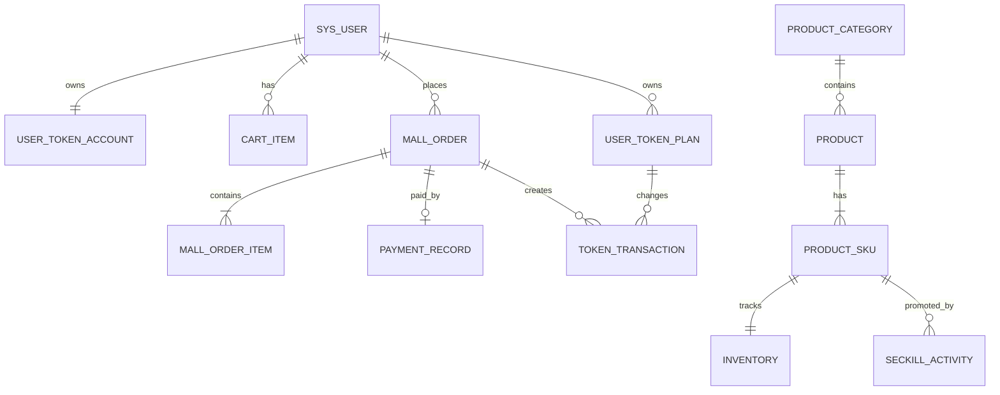
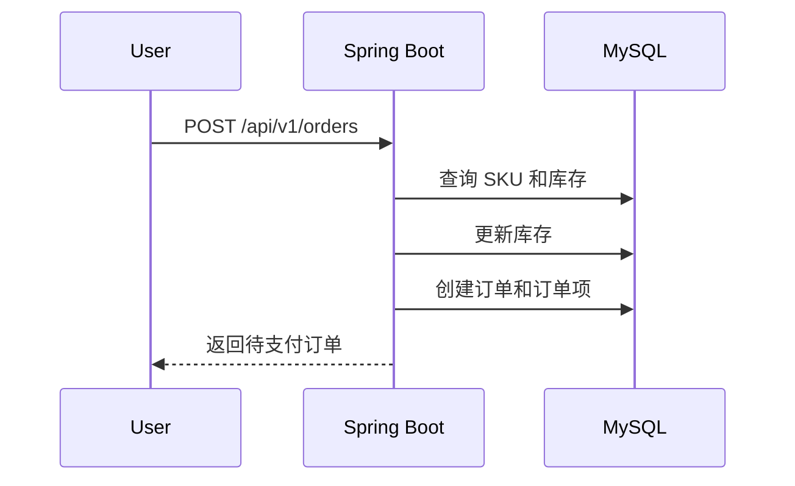
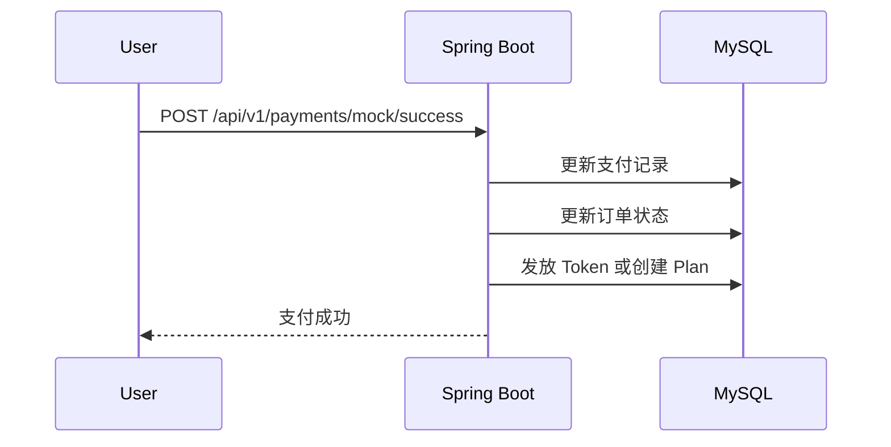
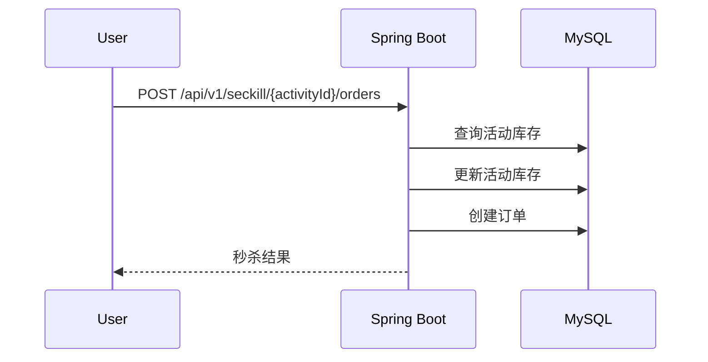

# TokenMall 技术架构

## 1. 架构目标

本项目采用模块化单体，原因是：

- 一个进程即可运行，适合个人学习。
- 模块边界清晰，后续可以单独拆出秒杀服务或消息服务。
- 可以在同一个事务和日志环境下学习 MySQL、Redis、RabbitMQ。
- 避免一开始引入注册中心、配置中心、网关和分布式追踪的额外成本。

## 2. 技术栈

| 层级 | 技术 |
| --- | --- |
| 语言 | Java 17 |
| 后端框架 | Spring Boot 3.x |
| 构建工具 | Maven |
| Web | Spring MVC |
| 安全 | Spring Security + JWT |
| 持久层 | MyBatis-Plus + 手写 SQL |
| 数据库 | MySQL 8.0.34 |
| 缓存 | Redis 3.0.504 |
| 消息队列 | RabbitMQ 4.3.6 |
| Erlang | OTP 28.5 |
| 前端 | React + TypeScript + Vite |
| 前端请求 | Axios 或 Fetch |
| 前端状态 | 按页面需要使用 TanStack Query 或轻量状态库 |
| 知识库 | Obsidian Markdown + 双向链接 + 自动索引脚本 |

## 3. 后端模块

```text
token-mall-backend
├─ mall-common
├─ mall-auth
├─ mall-user
├─ mall-catalog
├─ mall-inventory
├─ mall-cart
├─ mall-order
├─ mall-payment
├─ mall-token
├─ mall-seckill
├─ mall-messaging
└─ mall-admin
```

第一版可以不拆 Maven 多模块，而是在单个 Spring Boot 项目中使用包级模块：

```text
com.tokenmall
├─ common
├─ auth
├─ user
├─ catalog
├─ inventory
├─ cart
├─ order
├─ payment
├─ token
├─ seckill
├─ messaging
└─ admin
```

每个业务模块采用简单分层：

```text
module
├─ controller
├─ service
├─ mapper
├─ entity
├─ dto
└─ config
```

只有当代码形成明显依赖问题时，再升级为 Maven 多模块。

## 4. 模块职责

| 模块 | 职责 |
| --- | --- |
| common | 统一响应、异常、分页、工具、基础配置 |
| auth | 注册、登录、JWT、Spring Security |
| user | 用户资料、用户状态、Token 账户基础信息 |
| catalog | 分类、商品、SKU、商品查询 |
| inventory | 库存记录、普通库存调整、库存释放 |
| cart | 购物车项和结算选择 |
| order | 订单创建、状态机、订单项、超时关闭 |
| payment | 模拟支付、支付记录、支付幂等 |
| token | 资源包余额、用户 Plan、Token 流水和消费 |
| seckill | 秒杀活动、秒杀记录、秒杀下单入口 |
| messaging | RabbitMQ 配置、事件定义、生产者、消费者、DLQ |
| admin | 后台聚合接口和管理端业务入口 |

## 5. 核心数据关系



## 6. 初始版本请求链路

### 6.1 普通下单



初始版本故意保留以下风险：

- 查询库存后更新库存存在并发超卖。
- 订单、库存和后续 Token 发放可能不在正确事务边界内。
- 重复请求可能创建重复订单。

### 6.2 模拟支付



学习者需要把 Token 发放和通知迁移到 RabbitMQ。

### 6.3 秒杀初始版本



初始版本用于复现超卖。目标版本改为：

```text
Redis Lua 预扣 -> RabbitMQ 下单请求 -> MySQL 持久化 -> 结果通知或查询
```

## 7. Redis 目标设计

### 7.1 Key 规范

```text
mall:product:detail:{productId}
mall:sku:detail:{skuId}
mall:seckill:activity:{activityId}
mall:seckill:stock:{activityId}
mall:seckill:user:{activityId}:{userId}
mall:lock:order:{orderNo}
mall:lock:seckill:{activityId}:{userId}
mall:idempotency:order:{requestId}
mall:rate:seckill:{userId}
mall:token:account:{userId}
```

原则：

- 所有 Key 使用统一前缀。
- Key 中只放业务标识，不放敏感信息。
- 缓存 TTL 必须显式设置。
- 秒杀库存使用独立 Key，不与普通缓存混用。
- 锁 Key 必须包含具体业务对象，避免锁粒度过大。

### 7.2 Redis 使用边界

| 场景 | 数据结构 | 说明 |
| --- | --- | --- |
| 商品详情缓存 | String | 缓存序列化 JSON |
| 秒杀活动缓存 | String 或 Hash | 缓存活动元数据 |
| 秒杀库存 | String | Lua 原子判断和扣减 |
| 用户购买标记 | String 或 Set | 限购和幂等辅助 |
| 分布式锁 | String | `SET NX PX` |
| 限流 | String 或 Hash | Lua 实现计数或令牌桶 |
| 热点排序 | ZSet | 可选实验 |

Redis 3.0.504 不用于 Redis Streams 实验。

## 8. RabbitMQ 目标拓扑

### 8.1 交换器

| 交换器 | 类型 | 用途 |
| --- | --- | --- |
| `mall.order.exchange` | topic | 订单创建、支付和关闭事件 |
| `mall.token.exchange` | topic | Token 发放和消费事件 |
| `mall.seckill.exchange` | direct | 秒杀下单请求 |
| `mall.delay.exchange` | direct | 延迟消息 |
| `mall.dlx.exchange` | topic | 死信统一入口 |

### 8.2 队列

| 队列 | 绑定 | 用途 |
| --- | --- | --- |
| `mall.token.grant.queue` | `mall.order.exchange` / `order.paid` | 支付成功后发放 Token |
| `mall.order.timeout.delay.queue` | `mall.delay.exchange` / `order.timeout` | 延迟关闭订单 |
| `mall.order.timeout.queue` | `mall.dlx.exchange` / `order.timeout` | 处理超时订单 |
| `mall.seckill.order.queue` | `mall.seckill.exchange` / `seckill.order` | 异步创建秒杀订单 |
| `mall.cache.invalidation.queue` | `mall.order.exchange` / `product.changed` | 缓存失效实验 |
| `mall.token.grant.dlq` | `mall.dlx.exchange` / `token.grant.failed` | Token 发放失败消息 |
| `mall.seckill.order.dlq` | `mall.dlx.exchange` / `seckill.order.failed` | 秒杀下单失败消息 |

### 8.3 事件信封

所有消息使用统一信封：

```json
{
  "eventId": "uuid",
  "eventType": "order.paid",
  "eventVersion": 1,
  "occurredAt": "2026-09-20T12:00:00+08:00",
  "aggregateType": "ORDER",
  "aggregateId": "ORDER_NO",
  "traceId": "trace-id",
  "payload": {}
}
```

约束：

- `eventId` 全局唯一。
- 消费方使用 `eventId` 做幂等。
- 消息体不包含密码、Token 原文等敏感信息。
- 消息模型按事件命名，不使用模糊的 `data` 作为业务字段名。

## 9. MySQL 设计原则

- 所有业务表使用 BIGINT 主键。
- 金额使用 DECIMAL，不使用 FLOAT 或 DOUBLE。
- 订单保存商品快照，避免商品修改影响历史订单。
- 订单号、支付号、事件 ID 使用唯一索引。
- 消费幂等依赖数据库唯一键，不只依赖先查后写。
- 库存表保留 `version`，但初始版本故意不使用。
- 初始版本不建立物理外键，关系由应用和文档保证。
- 使用 `deleted` 字段实现逻辑删除。
- 查询条件必须有对应索引。

## 10. Spring Security 与 JWT

- `/api/v1/auth/**` 和公开商品接口允许匿名访问。
- 其他用户接口需要有效 JWT。
- `/api/v1/admin/**` 需要 `ROLE_ADMIN`。
- JWT 包含用户 ID、用户名、角色和过期时间。
- JWT 密钥从环境变量读取。
- 密码使用 BCrypt。
- 第一版只实现 Access Token，不实现 Refresh Token。

## 11. 事务边界学习点

需要重点观察：

1. 创建订单时，订单项和订单是否在同一事务。
2. 扣库存和创建订单失败时是否回滚。
3. 支付更新和 Token 发放是否应该同事务。
4. 消息发送在事务提交前还是提交后。
5. 重复支付回调是否会重复发放。
6. 超时关闭和支付同时发生时谁能成功。

## 12. 故意预留的问题

代码中统一使用以下注释标记：

```java
// LEARNING-BASELINE: 该实现故意保留并发或一致性问题。
// LEARNING-TODO: 学习者实现优化。
// LEARNING-VERIFY: 必须通过实验或测试验证。
```

所有问题编号统一为：

- `MYSQL-xx`
- `MQ-xx`
- `REDIS-xx`

## 13. 可观测性

第一阶段：

- Spring Boot 默认日志。
- MyBatis SQL 日志。
- RabbitMQ Management UI。
- Redis CLI 和图形化客户端。

第二阶段：

- Actuator。
- 请求耗时日志。
- 订单状态变更日志。
- MQ 消费日志。

第三阶段，可选：

- Prometheus + Grafana。
- 慢查询统计。
- 对账任务结果面板。

## 14. 架构决策记录

需要持续记录的 ADR：

- ADR-001 使用模块化单体而不是微服务。
- ADR-002 初始版本直接查改 MySQL。
- ADR-003 使用 RabbitMQ 而不是 Redis Streams 学习消息队列。
- ADR-004 使用 TTL + DLX 学习延迟消息。
- ADR-005 使用数据库唯一键实现消费幂等。
- ADR-006 使用 Redis Lua 实现秒杀原子扣减。
- ADR-007 知识库与代码放在同一仓库。

## 15. 后续可拆分方向

只有在 14 天目标完成后，再考虑：

- 将秒杀模块拆成独立服务。
- 引入独立订单消费者服务。
- 引入配置中心和注册中心。
- 引入 Redis Cluster 或 Sentinel。
- 引入 RabbitMQ 集群和镜像队列或仲裁队列。
- 引入链路追踪和统一日志平台。
