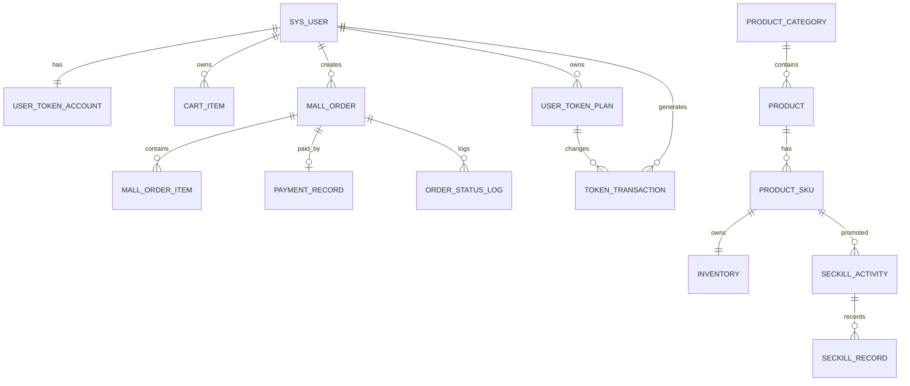

# TokenMall 数据库设计

## 1. 设计目标

数据库同时承担：

- 电商业务的权威数据存储。
- MySQL 并发、事务、索引和锁的学习实验场。
- Redis 与 RabbitMQ 优化前的简单基线。

数据库名：

```text
token_mall
```

字符集：

```text
utf8mb4
```

排序规则：

```text
utf8mb4_0900_ai_ci
```

## 2. 命名约定

| 对象 | 规则 | 示例 |
| --- | --- | --- |
| 表名 | snake_case，业务表可按模块加前缀 | `mall_order` |
| 主键 | `id` | `id` |
| 时间字段 | `created_at`、`updated_at` | `created_at` |
| 逻辑删除 | `deleted` | `deleted = 0` |
| 金额 | `DECIMAL` | `DECIMAL(10,2)` |
| 状态 | 大写字符串 | `PENDING_PAYMENT` |
| 唯一业务号 | 唯一索引 | `order_no` |

## 3. 表清单

| 表名 | 用途 |
| --- | --- |
| `sys_user` | 用户、密码、角色和状态 |
| `user_token_account` | 用户的资源包余额和 Plan 余额 |
| `product_category` | 商品分类 |
| `product` | 商品主数据 |
| `product_sku` | 商品销售规格 |
| `inventory` | SKU 库存 |
| `cart_item` | 购物车 |
| `mall_order` | 订单主表 |
| `mall_order_item` | 订单商品快照 |
| `order_status_log` | 订单状态变更记录 |
| `payment_record` | 模拟支付记录 |
| `user_token_plan` | 用户拥有的 Token Plan |
| `token_transaction` | Token 余额和 Plan 配额流水 |
| `token_usage_record` | Token 消费记录，可选使用 |
| `seckill_activity` | 秒杀活动 |
| `seckill_record` | 用户秒杀记录和限购依据 |
| `message_outbox` | 事务消息或 Outbox 学习表 |
| `idempotency_record` | HTTP 请求幂等学习表 |
| `mq_consume_log` | MQ 消费幂等记录 |

## 4. 关键关系



数据库不建立物理外键，原因：

- 便于学习和批量调整数据。
- 避免删除顺序影响 CRUD 实验。
- 模拟常见互联网业务的逻辑外键方案。

## 5. 订单状态

| 状态 | 含义 | 可迁移到 |
| --- | --- | --- |
| `PENDING_PAYMENT` | 待支付 | `PAID`、`CANCELLED`、`CLOSED` |
| `PAID` | 已支付 | `COMPLETED` |
| `COMPLETED` | 已完成 | 无 |
| `CANCELLED` | 用户取消 | 无 |
| `CLOSED` | 超时关闭 | 无 |

## 6. 支付状态

| 状态 | 含义 |
| --- | --- |
| `PENDING` | 等待支付 |
| `SUCCESS` | 支付成功 |
| `FAILED` | 支付失败 |

## 7. 秒杀活动状态

| 状态 | 含义 |
| --- | --- |
| `DRAFT` | 草稿 |
| `READY` | 已配置，等待开始 |
| `RUNNING` | 活动中 |
| `ENDED` | 已结束 |
| `CANCELLED` | 已取消 |

活动是否可抢，除状态外还必须校验当前时间。

## 8. Token 规则

### 8.1 资源包

- 支付成功后增加 `user_token_account.pack_balance`。
- 增加余额时写入 `token_transaction`。
- 流水金额为正数。

### 8.2 Token Plan

- 支付成功后创建 `user_token_plan`。
- `total_quota` 表示总配额。
- `used_quota` 表示已使用。
- `remaining_quota` 表示剩余。
- 到期后状态变为 `EXPIRED`。
- 配额用完后状态变为 `EXHAUSTED`。

### 8.3 消费顺序

第一版不实现消费算法。可选规则：

1. 优先消费即将过期的 Plan 配额。
2. Plan 配额不足时消费资源包余额。
3. 每次消费写 `token_usage_record` 和 `token_transaction`。

## 9. 初始版本故意问题

| 表或流程 | 问题 | 对应编号 |
| --- | --- | --- |
| `inventory` | 查询后更新导致并发超卖 | MYSQL-03 |
| `inventory` | `version` 字段保留但初始版本不使用 | MYSQL-05 |
| `payment_record` | 重复支付可能产生多次发放 | MYSQL-04 |
| `mall_order` | 超时扫描可能和支付并发 | MYSQL-05 |
| `seckill_activity` | 直接更新库存导致超卖 | MYSQL-03、REDIS-08 |
| `token_transaction` | 初始版本没有完整幂等来源 | MQ-04 |
| 缓存 | 初始版本没有缓存一致性流程 | REDIS-02、REDIS-04 |

## 10. 关键索引

| 表 | 索引 | 目的 |
| --- | --- | --- |
| `sys_user` | `uk_username` | 登录唯一性 |
| `user_token_account` | `uk_user_id` | 一个用户一个账户 |
| `cart_item` | `uk_user_sku` | 避免重复购物车项 |
| `mall_order` | `uk_order_no` | 订单号唯一 |
| `mall_order` | `idx_user_status_created` | 用户订单列表 |
| `payment_record` | `uk_payment_no` | 支付号唯一 |
| `payment_record` | `idx_order_no` | 按订单查询支付 |
| `seckill_activity` | `idx_status_time` | 活动列表 |
| `seckill_record` | `uk_activity_user` | 秒杀限购 |
| `token_transaction` | `idx_user_created` | 流水列表 |
| `mq_consume_log` | `uk_consumer_event` | 消费幂等 |

## 11. 事务边界

### 11.1 普通下单事务

理想边界：

```text
开始事务
  ├─ 校验商品和 SKU
  ├─ 扣减库存
  ├─ 创建订单
  ├─ 创建订单项
  └─ 记录状态日志
提交事务
```

初始版本需要学习者检查实际边界是否存在问题。

### 11.2 支付成功事务

理想边界：

```text
开始事务
  ├─ 校验订单状态
  ├─ 幂等校验
  ├─ 写入或更新支付记录
  ├─ 更新订单状态
  └─ 写入 Outbox 或消息任务
提交事务
异步发放 Token
```

### 11.3 超时关闭事务

```text
开始事务
  ├─ 锁定或条件更新订单
  ├─ 订单仍为待支付
  ├─ 更新为已关闭
  ├─ 恢复库存
  └─ 写状态日志
提交事务
```

## 12. 对账维度

秒杀与 Token 发放需要检查：

- 活动总库存 = 已售 + 活动剩余。
- Redis 预扣数量应等于成功订单数量加待补偿数量。
- 支付成功订单应存在 Token 流水或用户 Plan。
- MQ 消费日志中的成功事件应具有对应业务结果。
- 订单关闭次数与库存恢复次数应匹配。

## 13. 执行顺序

1. `db/01_schema.sql`
2. `db/02_seed.sql`
3. `db/03_create_dev_user.sql`

所有脚本需要由学习者自行在 MySQL 中执行。
