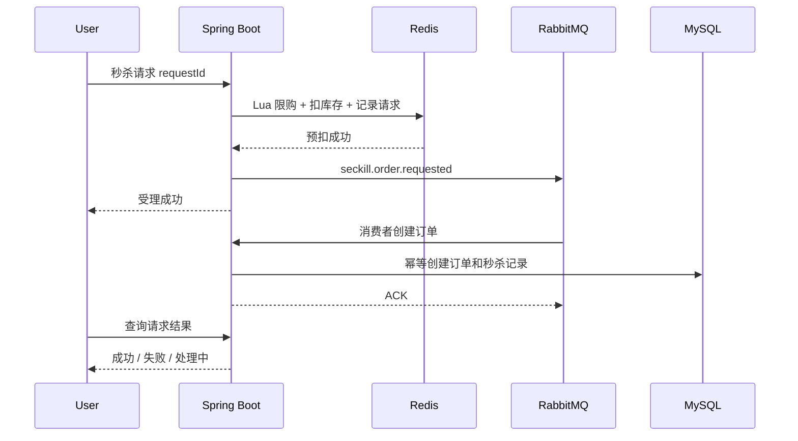

# Day 14：秒杀综合实现、对账与复盘

## 今日目标

- 完成 Token Plan 秒杀完整链路。
- 对比 MySQL 基线、Redis 预扣和 MQ 异步下单。
- 实现对账与异常补偿。
- 完成项目复盘、面试问题整理和架构图。

## 8 小时安排

| 时间段 | 内容 |
| --- | --- |
| 上午一 | 梳理秒杀基线问题和目标链路 |
| 上午二 | 完成 Redis Lua 预扣与用户限购 |
| 下午一 | 接入 RabbitMQ 异步下单 |
| 下午二 | 压测、对账和补偿 |
| 晚上 | 全项目复盘，提交 `day14` |

## 目标链路



## 秒杀前置校验

- 用户已登录。
- 活动存在。
- 活动状态为 `RUNNING`。
- 当前时间在活动区间内。
- 用户未超过限购。
- `requestId` 有效且唯一。
- 活动库存已预热到 Redis。

## Redis 原子脚本需要完成

至少包含：

1. 请求幂等检查。
2. 用户限购检查。
3. 库存检查。
4. 库存扣减。
5. 记录用户购买标记。
6. 保存请求状态。

设计要点：

- 所有判断和扣减尽量在同一个 Lua 脚本中完成。
- 返回明确结果码。
- 不要把无法回滚的外部调用放进 Lua。
- 记录脚本版本和 Key 版本。

## RabbitMQ 异步下单

消息包含：

- `eventId`
- `requestId`
- `activityId`
- `userId`
- `skuId`
- `quantity`
- 预扣价格
- 发生时间

消费方必须：

- 使用 `requestId` 或 `eventId` 幂等。
- 校验活动。
- 创建订单。
- 创建秒杀记录。
- 更新请求结果。
- 失败时进入 DLQ 或补偿流程。

## 数据一致性策略

### 场景 1：Redis 扣成功，MQ 发送失败

方案：

- 请求记录状态为待补偿。
- 定时任务扫描并重新发送。
- 超过阈值后回滚 Redis 库存并标记失败。

### 场景 2：MQ 消费失败

方案：

- 有限重试。
- 进入 DLQ。
- 人工或定时重放。

### 场景 3：MySQL 创建成功，Redis 状态更新失败

方案：

- 以 MySQL 成功订单为准。
- 补偿 Redis 请求状态。

### 场景 4：活动结束仍有预扣未落库

方案：

- 等待补偿窗口。
- 对账后回滚库存或完成订单。

## 对账公式

```text
活动总库存 = 成功订单数量 + Redis 剩余库存 + 待补偿数量
```

需要定期检查：

- `seckill_activity.seckill_stock`
- `seckill_activity.sold_count`
- `seckill_record`
- `mall_order`
- Redis 库存和用户购买标记
- RabbitMQ Ready、Unacked 和 DLQ

## 压测维度

| 指标 | 说明 |
| --- | --- |
| 请求总数 | 发起多少秒杀请求 |
| 成功受理 | Redis 预扣成功 |
| 库存不足 | Redis 返回失败 |
| 限购失败 | 用户重复请求 |
| MySQL 成功订单 | 最终落库数量 |
| MQ 积压 | Ready 和 Unacked |
| DLQ | 永久失败数量 |
| 对账差异 | Redis、MQ 与 MySQL 差异 |

## 前端要求

- 活动倒计时。
- 秒杀价格和原价。
- 活动库存展示。
- 抢购按钮状态。
- 请求中状态。
- 异步结果轮询。
- 成功、失败和处理中页面提示。

## 最终验收

- [ ] 同一用户重复请求只成功一次。
- [ ] 活动库存不会被扣成负数。
- [ ] MySQL 成功订单数量不超过活动库存。
- [ ] Redis 扣减成功但订单创建失败可被发现。
- [ ] MQ 失败消息可进入 DLQ。
- [ ] 对账任务能输出差异。
- [ ] 能对比基线、MySQL 修复和 Redis + MQ 三种方案。
- [ ] 能画完整秒杀时序图。
- [ ] 能解释每一个失败窗口。

## 最终复盘问题

- 为什么只在 MySQL 中加锁无法解决秒杀入口压力？
- 为什么 Redis 预扣后还需要 MySQL 唯一约束？
- 为什么发送消息成功不代表订单创建成功？
- 为什么秒杀结果查询需要独立接口？
- 为什么 Redis 扣减、消息发送和订单落库不能形成一个真正的分布式原子事务？

## 项目总回顾

必须能够回答：

1. 缓存是什么，什么时候失效？
2. MySQL 和缓存如何尽量保持一致？
3. RabbitMQ 为什么会产生重复消息？
4. 消费幂等如何落地？
5. 延迟消息如何关闭超时订单？
6. 秒杀如何削峰、限购、防超卖和补偿？
7. 如果 Redis 或 RabbitMQ 暂时不可用，系统应该如何降级？

## 今日复盘

- 实际完成：
- 关键证据：
- 遗留问题：
- 下一个最小行动：

## 关联

- 上一天：[[Day-13 - 分布式锁、Lua、幂等与限流]]
- 实验：[[秒杀对账实验]]
- 实验：[[并发扣库存实验]]
- 实验：[[消息重复投递实验]]
- 概念：[[秒杀系统]]
